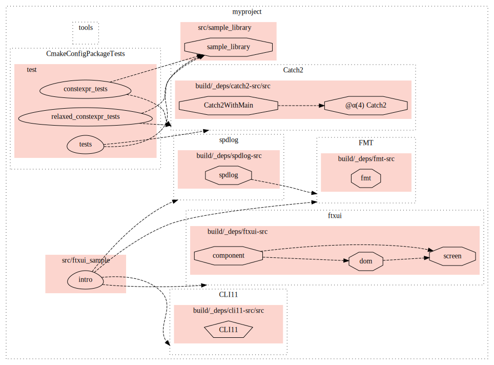

Trying out an idea to add more info to the `cmake --graphviz` graph.

For example:
```
git clone --recursive git@github.com:cpp-best-practices/cmake_template.git
cd cmake_template
cmake_graph setup -B build
cmake -S . -B build
...
cmake_graph graph -B build/ --skip-types UTILITY --skip-names test_ --frequent-deps-threshold 3
ls targetgraph-Release.svg
```

